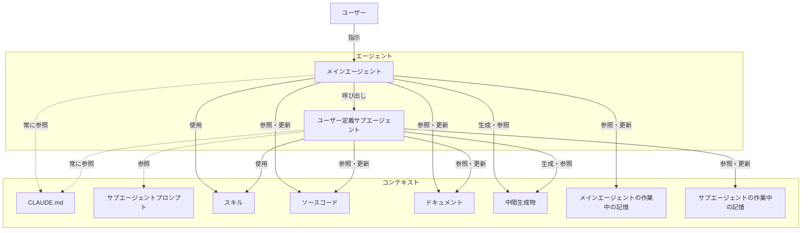

# 全体像とタスクの流れ

## 関係性の全体像

スキルからドキュメントへの参照矢印は意図的に存在しない。スキルは自己完結し、プロジェクト固有のドキュメントに依存させない（詳細は `code-and-docs.md` を参照）。

本図は設計対象となるユーザー定義サブエージェントに限定している。組み込みサブエージェントの位置づけは `agents.md` を参照。

## タスクの定義

ユーザーによるワークフロースキルの呼び出し（または個別の指示）を起点に、メインエージェントが必要に応じて複数のサブエージェントを順次呼び出しながら遂行する一連の作業単位。タスクの過程で中間生成物が生まれ、最終的にソースコードやドキュメントの変更に至る。

## 典型的なタスクの流れ

1. **ユーザーがワークフロースキルを呼び出す** — 定型作業（機能実装、リリース、バグ調査など）の起点として、ユーザーがメインエージェントにワークフロースキルを指定する。
2. **メインエージェントがワークフロースキルを読み込み、タスク全体をオーケストレーションする** — ワークフロースキルには、遂行手順と、各手順で呼び出すサブエージェント・How スキルの構成が記述されている。メインエージェントはこれに従い、タスクを分解する。
3. **メインエージェントが各手順でサブエージェントを呼び出す** — 具体的な作業は原則としてサブエージェントに委譲される。メインエージェントは CLAUDE.md とワークフロースキルを中心にオーケストレーション用のコンテキストを維持し、作業の詳細は自身のコンテキストに乗せない。
4. **サブエージェントが独立したコンテキストで作業する** — サブエージェントはサブエージェントプロンプトと CLAUDE.md を参照し、必要な How スキルを明示的に呼び出して作業を遂行する。ソースコードの参照・更新、ドキュメントの参照、中間生成物の生成はこの段階で行われる。
5. **サブエージェントが結果をメインエージェントに返す** — 作業過程の詳細はサブエージェント側で完結し、メインエージェントには結果のみが返る（独立コンテキストの意義は `agents.md` を参照）。
6. **メインエージェントが次の手順に進む、またはタスクを完了する** — ワークフロースキルに定義された全手順が完了した時点でタスクは終了する。最終成果はソースコードやドキュメントの変更として残る。

## 役割分担の2軸

この流れの中で2つの分離が実現される。

- **メインとサブの分離（オーケストレーション層 vs 実行層）** — メインエージェントはワークフロースキルに従ってタスクを分解・委譲することに専念し、具体的な作業はサブエージェントが独立コンテキストで遂行する。
- **エージェントとスキルの分離（What+Why 層 vs How 層）** — エージェント（メイン／サブを問わず）は「何をするか（What）」と「なぜそう判断するか（Why）」を担い、「どうやるか（How）」はスキルに委ねる（詳細は `agents.md` を参照）。

